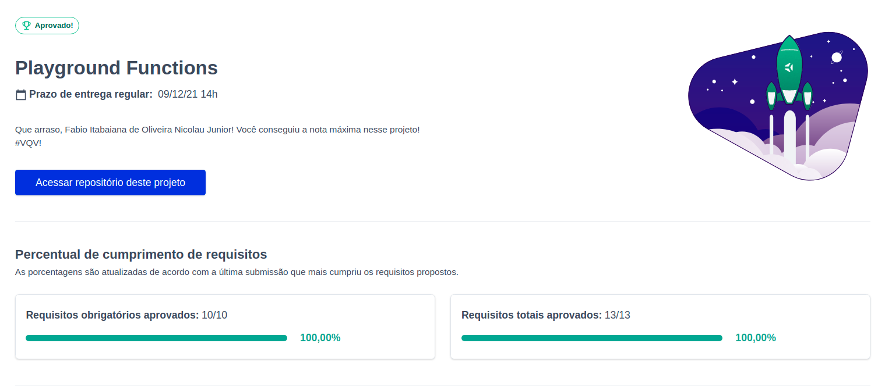

<h1>Sobre</h1>

Segundo projeto do módulo 1 - Fundamentos, da <a href="https://betrybe.com" target="_blank">Trybe!</a>

O desafio foi implementar funções a partir de requisitos fornecidos pela trybe.

<h1>Tecnologias utilizadas</h1>
<ul>
  <li>JavaScript</li>
</ul>

<h1>Nota</h1>

